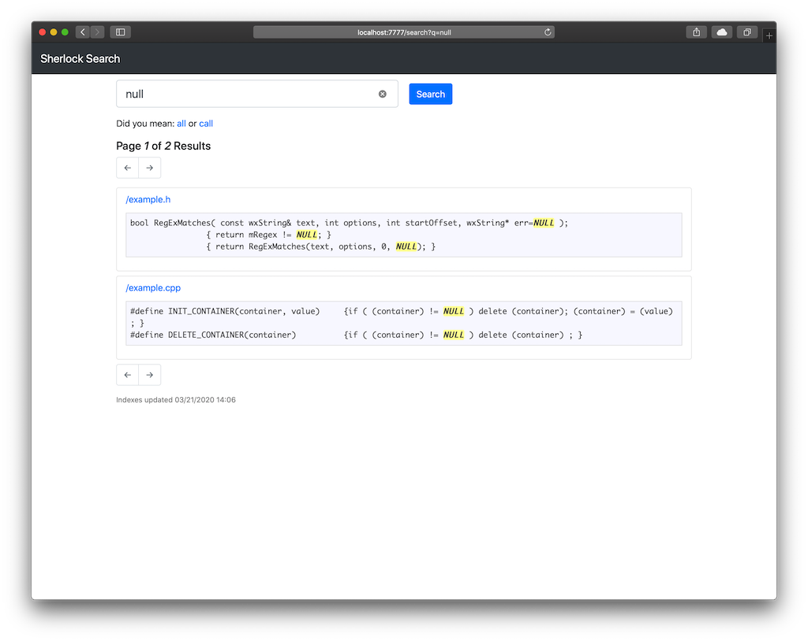
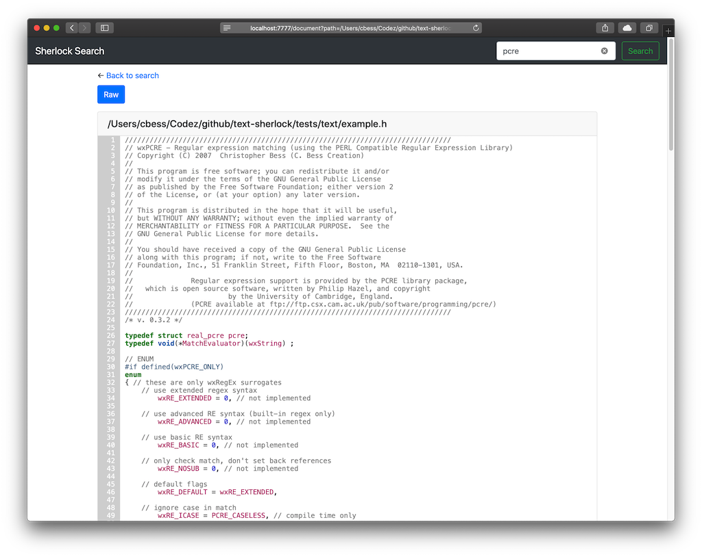

# Text Sherlock (or Sherlock) 

Provides a fast, easy to install and simple to use search engine for text, but optimized for source code. An alternative, [OpenGrok](https://github.com/OpenGrok/OpenGrok), requires too much time to install (though it may be worth it for some), but is more feature rich. Text Sherlock will give you a much easier setup, a text indexer, and a web app interface for searching with _very little_ effort.

[Soli Deo Gloria](https://perfectGod.com)

## Basic Setup

Instructions:

1. Download [Sherlock](https://github.com/cbess/text-sherlock) source from [GitHub](https://github.com/cbess/text-sherlock).
1. Extract/place the Sherlock source code in the desired (install) directory. This will be where Sherlock lives.
1. Run `sh setup/virtualenv-setup.sh` to setup an isolated environment and download core packages.
1. Configure settings. The defaults in [`settings.py`](settings.py) provide documentation for each setting.
	- Copy [`example.local_settings.yml`](example.local_settings.yml) to `local_settings.yml`.
	- Override/copy any setting from [`settings.py`](settings.py) to `local_settings.yml` (change the values as needed). All YAML keys/options **must** be lowercase.
1. Run `source sherlock_env/bin/activate` to enter the virtual environment.
1. Run `python main.py --index update` or `--index rebuild` to index the path specified in the settings. Watch indexing output.
1. Run `python main.py --runserver` to start the web server.
1. Go to `http://localhost:7777` to access the web interface. Uses the [Bootstrap](https://getbootstrap.com/) toolkit for it's UI.

You may need to install some packages before a *Ubuntu* installation will run without error.

- Install curl: `sudo apt-get install curl`
- Install uuid libs: `sudo apt-get install uuid-dev`
- Install python dev: `sudo apt-get install python-dev`

---

Includes:

- Settings/Configuration
	- See [`settings.py`](settings.py) for details.
- Setup script (read contents of script for more information)
	- Run [`virtualenv-setup.sh`](setup/virtualenv-setup.sh) to perform an isolated installation.
- Main controller script
	- Run `main.py -h` for more information.
- End-to-end interface
	- Indexing and searching text (source code). Built-in support for [whoosh](https://whoosh.readthedocs.io/en/stable/index.html) (fast searching) or [xapian](https://xapian.org/) (much faster searching).
	    - Easily extend indexing or searching via custom backends.
	- Front end web app served using [werkzeug](https://palletsprojects.com/p/werkzeug/) or [cheroot](https://cheroot.cherrypy.org).
	    - `werkzeug` is for development to small traffic.
	    - `cheroot` is the high-performance, pure-Python HTTP server used by [CherryPy](https://www.cherrypy.org).
	- Settings and configuration using [Python](https://python.org).

### Web Interface

Features:

Append to document URL.

- To highlight lines, append to URL: `&hl=3,7,12-14,21`
- To jump to a line, append to end of URL: `#line-3`

## Using other backends

In [`settings.py`](settings.py):

- Change the `default_indexer` and `default_searcher` values to match the name given to the backend.
    - Possible values:
        - `whoosh` the default, no extra work needed.
        - `xapian` must be installed separately using the included [`setup/install-xapian.sh`](setup/install-xapian.sh) setup script.

## Using other web servers

Text Sherlock has built-in support for [werkzeug](https://palletsprojects.com/p/werkzeug/) and [cheroot](https://cheroot.cherrypy.org) WSGI compliant servers.

In [`settings.py`](settings.py):

- Change the `server_type` value to one of the available server types.
    - Possible values:
        - `default`, werkzeug web server (default).
        - `cheroot`, production ready web server.

## Core packages

**Requires Python 3.5+**

* [Whoosh](https://whoosh.readthedocs.io/en/stable/quickstart.html)
* [Flask](https://palletsprojects.com/p/flask/)
* [Jinja2](https://jinja.palletsprojects.com/en/2.11.x/)
* [Pygments](https://pygments.org/docs/quickstart/)
* [peewee](https://github.com/coleifer/peewee)
* [Bootstrap v4.x](https://getbootstrap.com/docs/4.4/getting-started/introduction/)
* [PyYAML](https://pyyaml.org)

## Other References

* https://pygments.org/
* http://docs.peewee-orm.com/
* https://cheroot.cherrypy.org/
* https://xapian.org/
* https://pyyaml.org/wiki/PyYAMLDocumentation
* https://zeptojs.com

## Project Goals

1. Provide an easy to setup, fast, and adequate text search engine solution.
1. Be a respectable alternative to [OpenGrok](https://github.com/OpenGrok/OpenGrok).
1. Influence the [OpenGrok](https://github.com/OpenGrok/OpenGrok) contributors to provide a simpler setup process.
	- I successfully setup two installations of OpenGrok on CentOS and Ubuntu 11.x. Each time it took more than **two hours**. Text Sherlock setup takes less than 5 minutes (excluding package download time).

## Contributors

- [Christopher Bess](https://github.com/cbess)
- [Raphael Boidol](https://github.com/boidolr)
- [And others](https://github.com/cbess/text-sherlock/contributors)...
